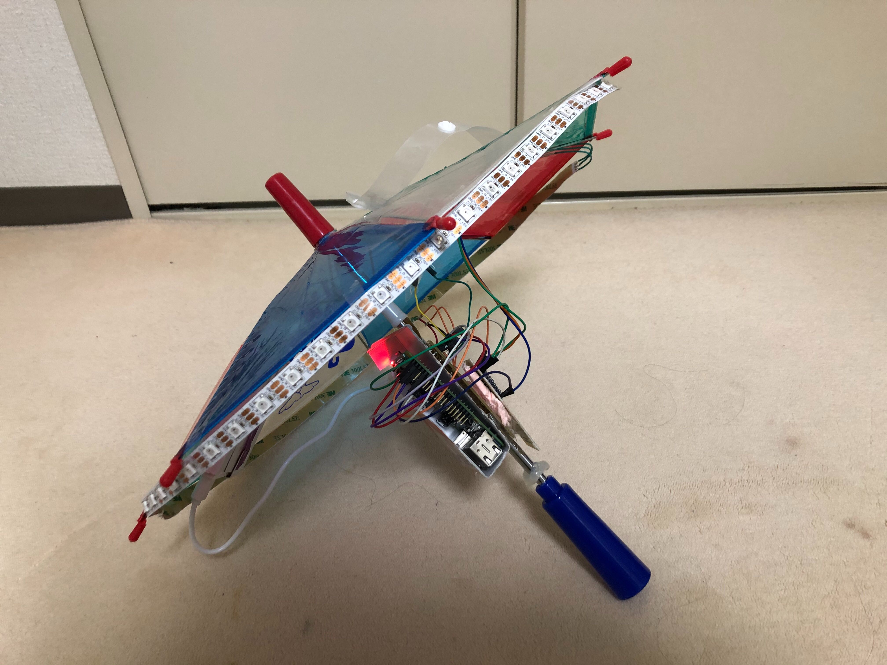
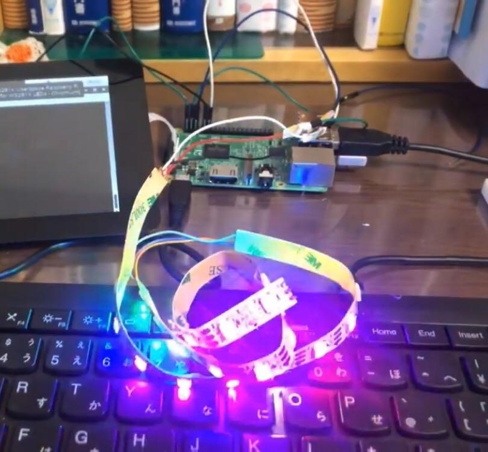
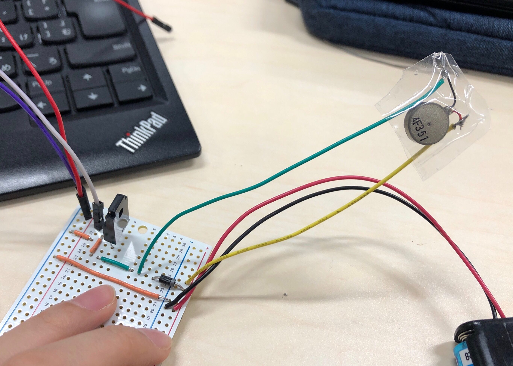
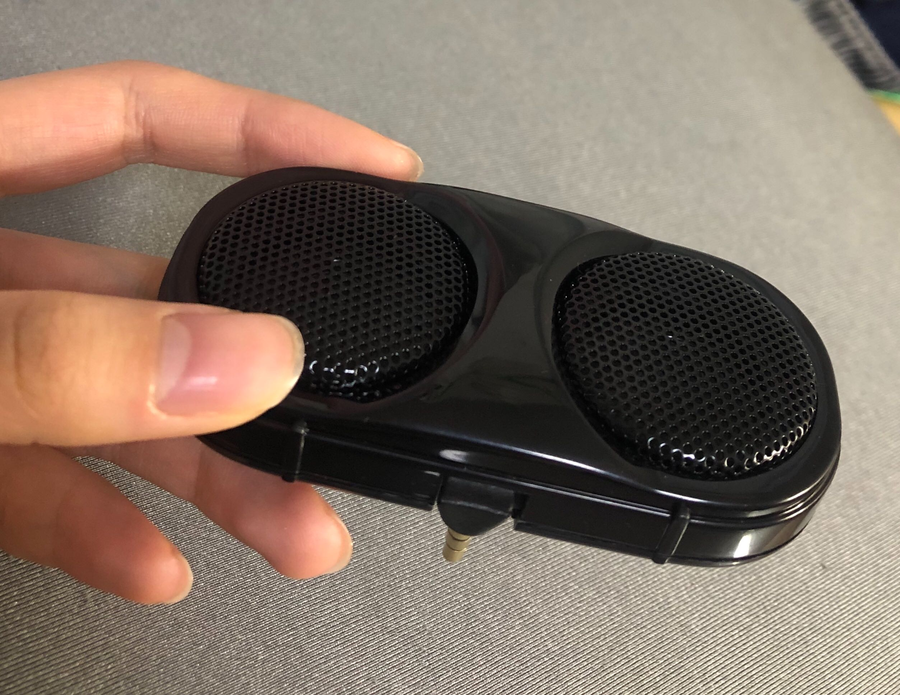

# 自主プロ
## 🍬あめが降る☔
「空から雨じゃなくて飴が降ってきてほしい！」という発想から、映像のあめを本物の傘で弾いて遊ぶゲームを作ってみました。<br>
完成作品の動画は[こちらをクリックして](https://www.youtube.com/watch?v=xAr7pQ0Ds3o&feature=youtu.be)見て下さい。<br>
<br>

### 実装方法
使うプログラムはmainに入ってるもの全てです。プロジェクターをPCに接続してPCのディスプレイ設定でミラーを選択します。<br>
<br>
まず、PC上でCoral TPUを立ち上げます。<br>
```bash
 roscore
```
```bash
 source /opt/ros/melodic/setup.bash
 rosrun usb_cam usb_cam_node
```
```bash
 source /opt/ros/melodic/setup.bash
 source ~/coral_ws/devel/setup.bash
 roslaunch coral_usb edgetpu_object_detector.launch INPUT_IMAGE:=/usb_cam/image_raw
```
```bash
 source /opt/ros/melodic/setup.bash
 rosrun image_view image_view image:=/edgetpu_object_detector/output/image
```
```bash
 rosrun rqt_reconfigure rqt_reconfigure
```
値は0.1くらいに設定します。プロジェクターから映し出された画像とCoral TPUの画像処理結果の画像の画角を合わせておきます。<br>
<br>
次に、Raspberry Pi上で<br>
```bash
 main$ sudo python3 ./rasp_server.py
```
<br>
最後に、PC上で<br>
```bash
 main$ python3 ./whole_game.py
```
<br>
これでゲームが始まります。<br>

### 〜ソフト編〜
#### 使うもの（予定）
* PC
* ~~Kinect~~
* Coral TPU

**まずは動画づくり**<br>
[参考サイト：失敗したけど画像貼り付け](https://www.qoosky.io/techs/b28ffe314d)<br>
[参考サイト：連番画像から動画作成](https://qiita.com/itoru257/items/228a91404fa77c780fd4)<br>
[参考サイト：アルファチャンネル画像を貼り付け](https://blanktar.jp/blog/2015/02/python-opencv-overlay.html)<br>

**python3 cv2 インストール**<br>
```bash
python3 -m pip install opencv-python
```

**GIMPでアルファチャンネル画像作成**<br>
Candyだけを背景画像に貼るためには.png形式のアルファチャンネル画像を作成する必要がある。<br>
レイヤー ▶ 透明部分 ▶ アルファチャンネルの追加<br>
選択 ▶ 色域を選択　->　アルファチャンネルにしたい部分の色を選択<br>
Delete -> これでアルファチャンネル画像が作成できる。<br>
ファイル ▶ 名前をつけてエクスポート ▶ .pngで保存<br>

### 傘とあめがあったたかどうかの判定<br>
* 方法その１<br>
Kinectで写真と同じ画像を認識して/object_pose使う。<br>
```bash
 source ~/semi_ws/devel/setup.bash
 roslaunch openni_launch openni.launch camera:=head_camera
 roslaunch recog_umbrella.launch
```
* 方法その２<br>
ROSのBoundingBoxArrayを使う。<br>
```bash
 roslaunch kinect.launch
```
パラメータ調節したいときは<br>
```bash
 rosrun rqt_reconfigure rqt_reconfigure
```
役に立つか不明だけど[ここ](https://www.color-sample.com/colors/397/)にHSL(HSI?)の色見本が載っている。<br>

* プロジェクターの画像の認識->プロジェクターからの映像とカメラの映像の画角を合わせて比で位置を計算する。<br>

* \-----pythonでやるなら-----<br>
[参考になりそうなサイト](https://docs.opencv.org/master/d7/d6f/tutorial_kinect_openni.html)<br>
[python](https://gist.github.com/joinAero/1f76844278f141cea8338d1118423648)<br>
[演習のサイト](http://www.cyber.t.u-tokyo.ac.jp/~narumi/class/mech_enshu/)<br>

* 方法その３<br>
方法その１とその２は失敗したのでCoral TPUの情報をSubscribeする。<br>
```bash
 roscore
```
```bash
 source /opt/ros/melodic/setup.bash
 rosrun usb_cam usb_cam_node
```
```bash
 source /opt/ros/melodic/setup.bash
 source ~/coral_ws/devel/setup.bash
 roslaunch coral_usb edgetpu_object_detector.launch INPUT_IMAGE:=/usb_cam/image_raw
```
```bash
 source /opt/ros/melodic/setup.bash
 rosrun image_view image_view image:=/edgetpu_object_detector/output/image
```
パラメータをいじるなら<br>
```bash
 rosrun rqt_reconfigure rqt_reconfigure
```
<br>

### OSC通信
Ubuntu と Rasoberry piのデータのやり取りにはOSC通信を用いる。<br>
**python3 pythonosc インストール**<br>
```bash
pip3 install python-osc
```
コードは[公式ページ](https://github.com/attwad/python-osc)から拾ってくる。--ipのdefaultはRaspberry piでifconfigして調べた値にする。wlan0のところのinetの後に続く数字が知りたいIPアドレス。必ず先にserverを立ち上げること。OSC通信ではserverがデータを受け取る側、clientがデータを送る側らしい、不思議...。<br>
---------通信だけならこれでもおっけー↓-------<br>
＜設定＞Raspberry pi, Ubuntuそれぞれに[このサイトを参照して](https://qiita.com/nnn112358/items/038abad1546de8057b0e)設定をする。<br>
ifconfigで受信側のIPアドレスを調べて、サーバー側で`./oscer IPアドレス 10000 /hello`とし、クライアント側で`./oscer receive 10000`とすれば/helloを受け取ることができる。<br>

### 〜ハード編〜
**使うもの（予定）**
* Raspberry pi
* LEDテープ
* 振動モーター
* ~~スピーカー~~

### Raspberry piの基本<br>
ラズパイのセットアップやピンの位置など、ラズパイの詳細については[BDMのREADME.md](https://github.com/MiyabiTane/BDM)参照。<br>
Ubuntuにすると使えなくなる機能があるので今回はRasbianでOSC通信を行うことにする。<br>

-----------------Ubuntuでやりたい人は↓-------------------------------<br>
ただし、今回はROSを使うためにUbuntu Mateをいれたいので、MicroSDのセットアップでは以下に従う。<br>
[公式ページ](https://www.raspberrypi.org/downloads/)でUbuntu MATEをダウンロードする。
PCのUbuntuでターミナルを開く。まず、SDカードを挿したときと挿さない時とで
`$ df -h`
を実行してその差分を見ることでSDカードのデバイス名を見る。/dev/mmcblk0p1 だったらデバイス名は /dev/mmcblk0<br>br
デバイスをアンマウントする。<>
ダウンロードしたファイルを解凍。今回は　ubuntu-mate-18.04.2-beta1-desktop-armhf+raspi-ext4.img.xz
をダウンロードしたので<br>
`$ xz -dv ubuntu-mate-18.04.2-beta1-desktop-armhf+raspi-ext4.img.xz `<br>
ファイルが解凍されて　ubuntu-mate-18.04.2-beta1-desktop-armhf+raspi-ext4.img ができるので<br>
`$  sudo dd bs=4M if=ubuntu-mate-18.04.2-beta1-desktop-armhf+raspi-ext4.img of=/dev/mmcblk0`<br>
最後に`$ sync`として、アンマウントしてからSDを抜く。<br>

ROSをいれるにはRaspberry pi上のターミナルで[このページ](http://wiki.ros.org/melodic/Installation/Ubuntu)
に書いてあることを忠実に打ち込む。<br>

### フルカラーシリアルLEDテープ<br>
[このページに載っているGitHubのコードをダウンロード！](http://jellyware.jp/kurage/raspi/led_stick.html)<br>
ロジック変換しないでも光らせることはできるが、安全のためロジック変換ICを用いることにした。<br>
上記サイトの"回路結線図"以降を参照。
strandtest.pyの中身を応用すれば良さそう。<br>

**＜python3でLEDテープを動かすには＞**<br>
上記のコードはsudo pythonで実行する必要があり、osc通信はpython3で実行するため共存できない。python3で動かしたい場合は次のようにする。<br>
```bash
sudo pip3 install rpi_ws281x
git clone　https://github.com/rpi-ws281x/rpi-ws281x-python
cd rpi-ws281x-python/example
chmod 755 *.py
sudo python3 strandtest.py
```



### 振動モーター
回路は[このサイト](https://www.petitmonte.com/robot/howto_vibrating_motor.html)に書いてあるとおりに組む。<br>
コードについてはwiringpiではGPIOの制御がうまくいかないのでRPi.GPIOを使う。<br>


### スピーカー
Raspberry piのイヤホンジャックに刺せるタイプのものを購入。Raspberry piの音声出力をイヤホンジャックに設定しておく。<br>
<br>

[音源の音量を上げるサイト](https://www.mp3louder.com/jp/)や[音源をカットできるサイト](https://mp3cut.net/ja/)があってとても便利。<br>
無料の音源はこちらを参照↓<br>
[<効果音ラボ>](https://soundeffect-lab.info/sound/various/)<br>
[<音人>](https://on-jin.com/sound/hito.php)<br>
[<ポケットサウンド>](https://pocket-se.info/archives/tag/%E3%81%8B%E3%82%8F%E3%81%84%E3%81%84/page/3/)<br>
[<ポップモーション>](https://otologic.jp/free/se/motion-pop05.html)<br>
